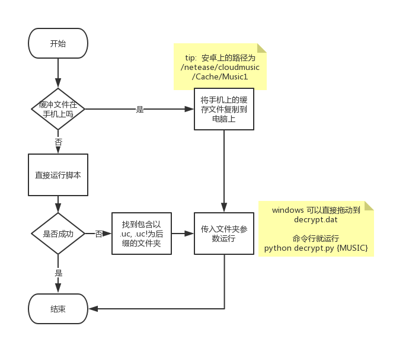

# netease-music-cracker
[](https://github.com/mbinary/netease-music-cracker/stargazers)
[](https://github.com/mbinary/netease-music-cracker/network/members)
[](LICENSE)
[](https://github.com/mbinary/netease-music-cracker/graphs/contributors)
[](.)
[](https://travis-ci.org/mbinary/netease-music-cracker?branch=master)
[](https://codecov.io/github/mbinary/netease-music-cracker?branch=master)
[](https://codebeat.co/projects/github-com-mbinary-netease-music-cracker-master)
<!--  [](http://creativecommons.org/licenses/by-nc-sa/4.0/)  copy LICENCE -->
<!-- 控制图片:  -->
# 前言


网易云音乐的缓存文件经过处理,也就是异或加密了的,要获得MP3文件,需要解密. 这个仅用于学习. 请大家**尊重版权**.其实大多数歌曲都是可以下载的

## 介绍
从网易云音乐缓存文件得到 mp3 格式. 
利用缓存文件,解密得到MP3文件, 并通过其metadata,命名文件,顺便从api或者网页抓取歌词,详细介绍可以看[这里](https://mbinary.coding.me/decrypt-netease-music.html) 

## 依赖
* python 模块
  - requests
  - mutagen

运行 如下命令安装
```shell
$ pip install -r requirements.txt
```

## 使用


(我没有在 linux 上用过 网易云音乐, 所以我现在不知道路径, 需要使用者自己找, 欢迎知道的同学告诉我)

我上传了两个示例文件在 `src/music`中, 
可以运行
`python3 decrypt.py src/music` 尝试

## 展示


## 结果
在当前目录(运行此脚本的目录)中, 生成文件夹`网易云音乐缓存`, 结果就在其中:smiley: 

