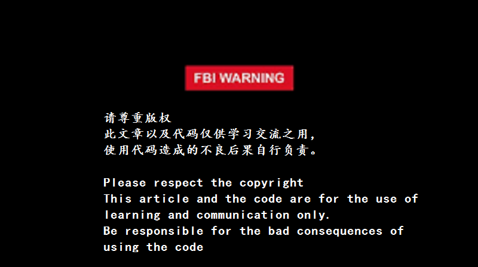

# netease-music-cracker
[](https://github.com/mbinary/netease-music-cracker/stargazers)
[](https://github.com/mbinary/netease-music-cracker/network/members)
[]()
[](LICENSE)
[]()
<!--  [](http://creativecommons.org/licenses/by-nc-sa/4.0/)  copy LICENCE -->
<!-- 控制图片:  -->
# 前言


网易云音乐的缓存文件经过处理,也就是异或加密了的,要获得MP3文件,需要解密. 这个仅用于学习. 请大家**尊重版权**.其实大多数歌曲都是可以下载的

## 介绍
从网易云音乐缓存文件得到 mp3 格式. 
利用缓存文件,解密得到MP3文件, 并通过其metadata,命名文件,顺便从api或者网页抓取歌词,详细介绍可以看[这里](https://mbinary.coding.me/decrypt-netease-music.html) 

## 依赖
* python3
* python 模块
  - requests
  - mutagen (optional)
运行 一下命令安装
```python
sudo pip install requests
sudo pip install mutagen
```

## 使用

### 获得缓存文件
下面两种方法都行
* 手机上的在 `netease/cloudmusic/Cache/Music1`里,将其复制到电脑上
* 或者在电脑上 `**/cloudmusicdata/Cache`.

最终得到的路径记为 `MUSIC`

### 运行
下面两种方法都行
* 在命令行模式下
`python3 decrypt.py $MUSIC`

这里的 `MUSIC`  就是缓存文件（包含`.uc` 或 `.uc!` 文件）的地址

* 复制此脚本到缓存文件的父目录,要求缓存文件命名为`Music1`, 然后直接运行脚本

我在 这个 repo 里面上传了几个缓存文件,可以作为测试,在 [Music1](Music1) 中

## 展示
这是 gif 


## 结果
 你就可以到缓存文件目录的父目录下 看到 `cached_网易云音乐`, 以及其中的 `lyric`, `music` :smiley: 

* 运行输出
 

* 歌词
 

* MP3
 
