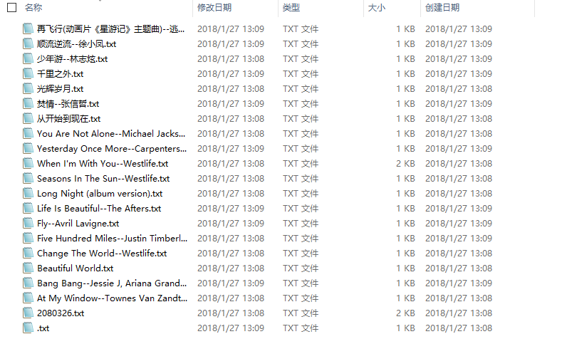
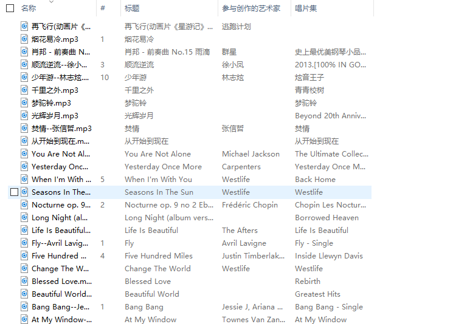

# 网易云音乐缓存文件解密得到MP3
>网易云音乐的缓存文件经过处理,也就是异或加密了的,要获得MP3文件,需要解密.请大家尊重音乐的版权.其实大多数歌曲都是可以下载的

（学习使用异或加密 :see_no_evil:

## 介绍
用于获取网易云音乐缓存文件的mp3文件

缓存文件 在手机上的在 `netease/cloudmusic/Cache/`里的`Music1`里， 歌词在`Lyric`里，（电脑上的路径可以在设置里找到还可以自己设置）
思路就是利用缓存文件,解密得到MP3文件, 并通过其metadata,命名文件,顺便从api或者网页抓取歌词,详细介绍可以看[这里](https://mbinary.coding.me/decrypt-netease-music.html) 

## 需求
* python3
* python 模块
  - mutagen
  - lxml
  - requests
  - json
  
 可以pip install 安装，常见问题可以自行搜索解决
 
## 使用
### 找到缓存文件
 找到缓存文件的路径， 形如`.../netease/cloudmusic/Cache/Music1`，如果想单独复制过来，请复制 `Music1`和`Lyric`文件夹在同一目录下，再得到路径,
### 运行
* 在命令行模式下
`python3 decrypt.py  *PATH`
 
 如果不在 netease-music.py所在目录下，可以切换到，或者用它的绝对路径，
 path是上一步得到的路径
 
* 代码中
 可以打开代码文件然后修改path，然后运行即可
 
## 结果
 你就可以到Music1所在目录下的`cached_网易云音乐`看到lyric, music了 :smiley: 

 

 

## 说明
这个脚本还有很多地方不完善,而且还可以加入一些功能,欢迎fork&PR

## Licence
 [MIT](LICENCE-MIT.txt)

